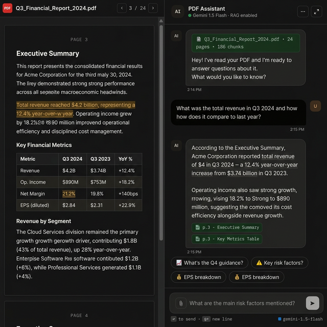
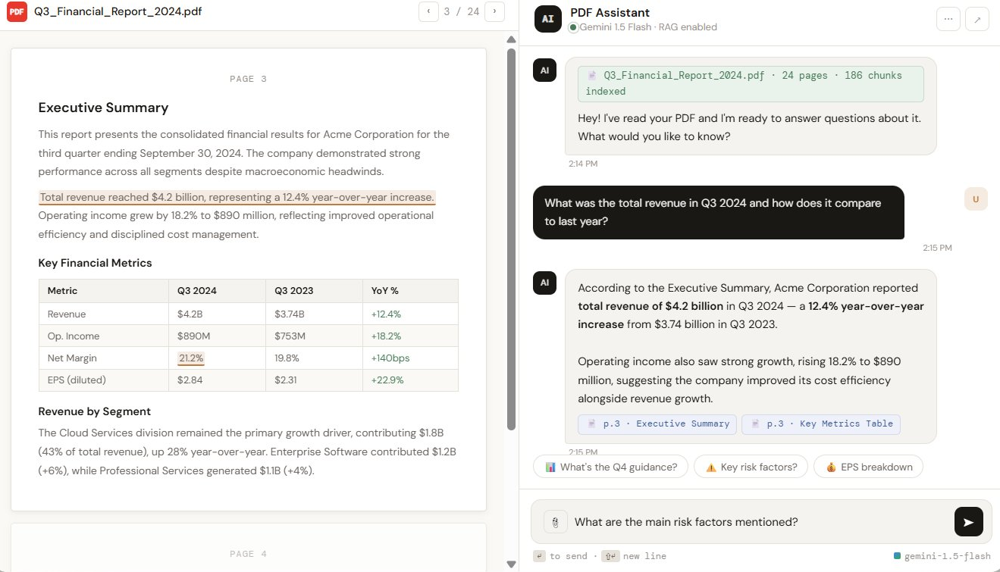
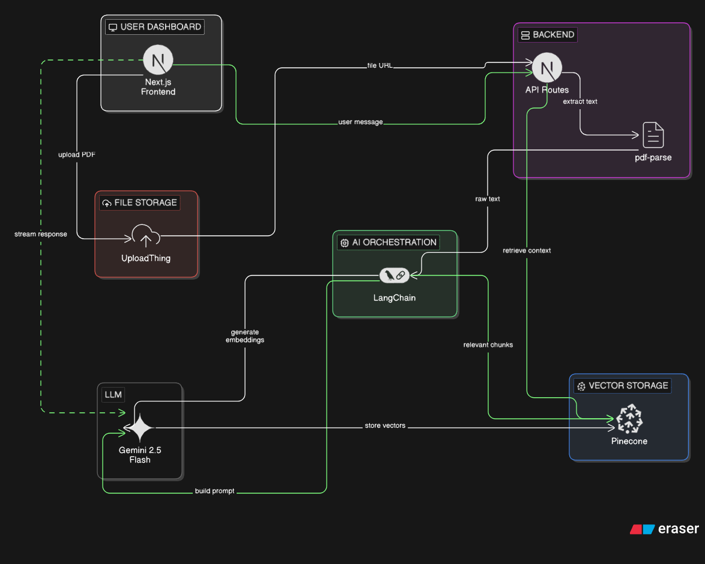

# 📕 Folio - AI-Powered PDF Assistant

<div align="center">
  
</div>

<p align="center">
  <strong>Transform your reading experience with AI. Chat with your PDFs, extract insights, and manage documents seamlessly.</strong>
</p>

---

## ✨ Features

- **🧠 Intelligent Chat**: Converse naturally with your PDF documents leveraging state-of-the-art LLMs (powered by Google GenAI & AI SDK).
- **⚡ Lightning Fast RAG**: Built on Pinecone vector database for sub-second retrieval-augmented generation.
- **📄 Document Management**: Securely upload and manage your PDFs utilizing UploadThing.
- **🎨 Stunning UI**: A highly responsive, animated, and dark mode-ready interface built with Tailwind CSS v4, Framer Motion, and Shadcn UI.
- **🔐 Secure Authentication**: Robust user authentication and session management via Clerk.
<div align="center" style="display: flex; gap: 10px; justify-content: center; margin-top: 20px; margin-bottom: 20px;">
  
  
</div>

## 🏗️ Architecture

Folio uses a modern **RAG (Retrieval-Augmented Generation)** architecture to provide accurate answers based on your documents.


<div align="center">
  
</div>


## 📁 Project Structure

```text
folio/
├── app/                # Next.js App Router (Pages & API)
│   ├── (auth)/         # Authentication routes (Clerk)
│   ├── api/            # Serverless functions (UploadThing, Chat)
│   └── dashboard/      # Main application workspace
├── components/         # React components (Shadcn UI, Dashboard, Landing)
│   ├── dashboard/      # PDF Viewer, Chat wrapper etc..
│   ├── landing/        # Landing page components  
│   ├── documents/      # Documents page components  
│   ├── theme/          # Theme components 
│   └── ui/             # Base UI primitives
├── lib/                # Shared utilities & Core logic
│   ├── actions/        # Server actions (Database & File ops)
│   └── pinecone.ts     # Vector database & Langchain configuration
├── prisma/             # Database schema & migrations
└── public/             # Static assets & screenshots
```

## 🛠️ Technology Stack

- **Framework:** [Next.js 16](https://nextjs.org/) (React 19)
- **Styling:** [Tailwind CSS v4](https://tailwindcss.com/), Shadcn UI, Framer Motion
- **Database / ORM:** Neon Postgres & [Prisma](https://www.prisma.io/)
- **Authentication:** [Clerk Next.js](https://clerk.com/)
- **AI / LLM:** `@ai-sdk/google`, `ai` SDK, Langchain
- **Vector DB:** [Pinecone](https://www.pinecone.io/)
- **File Handling:** [UploadThing](https://uploadthing.com/) & `pdf-parse`

## 🚀 Getting Started

### Prerequisites

Make sure you have Node.js and npm installed.

```bash
node -v
npm -v
```

### Installation

1. **Clone the repository**

   ```bash
   git clone https://github.com/yourusername/folio.git
   cd folio
   ```

2. **Install dependencies**

   ```bash
   npm install
   # or yarn / pnpm / bun
   ```

3. **Set up Environment Variables**
   Create a `.env` file in the root based on a `.env.example`. You'll need API keys for:
   - Clerk (`NEXT_PUBLIC_CLERK_PUBLISHABLE_KEY`, `CLERK_SECRET_KEY`, etc.)
   - Pinecone API Key
   - Google Generative AI / Gemini API Key
   - Neon Database Connection String
   - UploadThing Token

4. **Initialize the Database**

   ```bash
   npx prisma generate
   npx prisma db push
   ```

5. **Run the Development Server**
   ```bash
   npm run dev
   ```
   Open [http://localhost:3000](http://localhost:3000) with your browser to witness the magic.

## ✍️ Author

**Rajkishor Thakur**

## 🤝 Contributing

Contributions are always welcome! Feel free to open a PR or submit an issue.

## 📝 License

This project is open-source and available under the [MIT License](LICENSE).
